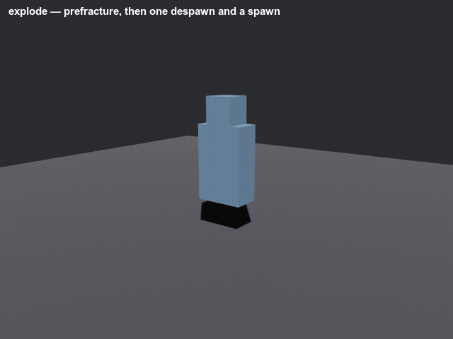

# bevy_autogib

> ⚠️ **Vibe Coded** — written by an AI agent working from a human's direction. It is used in a shipping game and covered by tests, but it has had no line-by-line human audit. Read it before you trust it.

Runtime mesh fracture: take whatever meshes an entity actually loaded, recursively plane-cut them into watertight-capped chunks, bake that once per source asset, and swap the pieces in when the thing dies.



That is `examples/explode.rs`, unmodified and at its own 0.4× playback. The subject is intact, then it is its own fragments — the "break" is one despawn and a spawn, because the fracture was computed long before. **The red is not a colour choice, it is the whole idea:** every fragment comes back as two meshes, the subject's original surface and the faces this cut just created, so you can give the inside a different material. Render both with the skin material and the same fragments stop looking broken and start looking disassembled.

> **This repo is the source of truth.** It owns the crate; changes are made here and nowhere else. [`Ladvien/foundation_vs_slop`](https://github.com/Ladvien/foundation_vs_slop) consumes it as a git dependency pinned to a rev, the same way any other consumer would. It was the other way round — a read-only `git subtree split` mirror — until recently, and that inversion is a known stale-read hazard: a `subtree split` carries only *commits*, so anything living uncommitted in the monorepo working tree could never arrive by that route. If you find a `crates/bevy_autogib/` in a monorepo checkout, it is a corpse.

## The idea: break the asset once, not the frame

The tempting version of this feature computes a fracture at the moment of impact. The shipped version of this feature, in more or less every game that has one, does not — it **pre-fractures the asset and replaces the intact model at runtime**, which is exactly what Müller, Chentanez & Kim document as the practical norm (ACM TOG 2013) before presenting the volumetric decomposition most projects then don't use. Sellán et al.'s *Breaking Good* (ACM TOG 2022) is the most physically honest option available and its fragments are precomputed **offline**, through tetrahedralization and a conic solve in a Python/libigl toolchain — not something a minimal-dependency Rust crate can embed.

So this is the geometric plane-cutter family *Breaking Good* compares against (Schvartzman & Otaduy 2014; Museth et al. 2021 — "bumpy planes slicing through the input"): recursively slice the merged mesh with pseudorandom planes through each piece's centroid, always cutting the **largest** remaining piece, and **cap every cut watertight** — Sutherland–Hodgman triangle clip, welded boundary-loop assembly, fan-triangulated cap with a planar cross-section UV.

Those caps are the reason this is a crate. Slicing a triangle soup is undergraduate geometry; making the cut *close* on real, non-manifold, artist-exported input — welding a boundary loop on a lattice, chaining disjoint loops when a plane passes through two legs, and dropping a chain that never closes rather than fanning garbage over it — is the part the graphics literature leaves to engine code.

Be clear about what that last one costs, because it is a real trade and not a free win: a dropped chain means **that face is left open**. On genuinely non-manifold input — and a character merged from a torso, a head and a rifle is non-manifold wherever those shells meet — some cuts near a seam will not close, and those fragments have an uncapped region. The alternative is fanning a triangle set over a boundary that isn't a loop, which produces self-intersecting surface that shades wrong from every angle. A hole you can hide behind fast, bloody motion; bad geometry follows the chunk around. The crate `warn!`s each drop so the count is visible rather than silent. And the literature is explicit that this is good enough: plane-cut prefracture artifacts are "hidden behind destruction dust or obscured by fast explosions."

Each fragment comes back as **two** meshes — the subject's original outer skin, and the cut faces alone. Give them different materials. That contrast, outfit against raw interior, is the entire visual read; a fracture rendered in one material just looks like the model fell apart.

```rust
use bevy::prelude::*;
use bevy_autogib::{AutogibPlugin, AutogibSystems, DetachedPart, FractureCache, FractureSubject};

#[derive(States, Debug, Clone, PartialEq, Eq, Hash, Default)]
enum GameState { #[default] Playing, Paused }

fn wire(app: &mut App) {
    app.add_plugins(AutogibPlugin)
        // The crate configures no run condition — when the bake runs is yours.
        .configure_sets(Update, AutogibSystems.run_if(in_state(GameState::Playing)));
}

// Mark what should break, and what should come off intact.
fn spawn_enemy(mut commands: Commands, assets: Res<AssetServer>) {
    let scene: Handle<WorldAsset> = assets.load("enemy.glb#Scene0");
    let enemy = commands.spawn((FractureSubject(scene.clone()), WorldAssetRoot(scene))).id();
    // ...once the scene streams in, tag whatever should detach intact:
    commands.entity(enemy).insert(DetachedPart);
}

// Later, at the moment of death — the launch is yours, and so is the solver.
fn on_death(cache: Res<FractureCache>, subject: &FractureSubject) {
    // One bake, read back at whatever granularity this death deserves. `leaves` is the finest;
    // `frontier_of(3)` is the same cached bake as three big chunks.
    for frag in cache.leaves(subject.0.id()) {
        let _ = (&frag.outer_mesh, &frag.cap_mesh, frag.center_local, frag.half_extents);
    }
    for frag in cache.frontier_of(subject.0.id(), 3) {
        let _ = frag.id;
    }
}
```

You do not need an `App` to use the fracture itself. [`fracture_mesh`] is the whole pipeline with no assets and no ECS — meshes in, meshes out:

```rust
use bevy::math::{Mat4, Vec3, primitives::Cuboid};
use bevy::mesh::Mesh;
use bevy_autogib::ProxyCell;

let body = Mesh::from(Cuboid::new(1.0, 2.0, 1.0));

// **The proxy is yours.** This crate cuts a convex decomposition and carries your triangles along
// as a payload — it never cuts the triangle soup. One cell per connected shell; a consumer already
// running V-HACD or CoACD for colliders has these, and a blocked-out subject can use `from_box`.
let proxy = vec![ProxyCell::from_box(Vec3::ZERO, Vec3::new(0.5, 1.0, 0.5))];

let baked = bevy_autogib::fracture_mesh(
    &[(&body, Mat4::IDENTITY)],
    &proxy,
    12,          // finest fragment count
    0.15,        // stop cutting below this fraction of the subject's size
    64,          // how many cuts deep the hierarchy may go
    0xC0FFEE,    // seed — same seed, same pieces, every run
);

// **One bake, every granularity.** The cut loop keeps each piece it split, so the same bake
// answers "three pieces" and "all of them" without cutting twice.
assert_eq!(baked.frontier_of(3).len(), 3);
let pieces = baked.leaves();
assert!(pieces.len() > 1);
// Every piece is a closed convex solid — hand `cell` straight to a solver as one convex collider.
assert!(pieces.iter().all(|p| p.outer.is_some() || p.cap.is_some()));
```

## One bake, every granularity

A bake does not produce *a* fragment set. It produces the whole binary forest it cut through — one tree per proxy cell — and any **frontier** of that forest is a valid decomposition that tiles the subject exactly once. Three big chunks for a cleaving blow and forty for a blast come from the same cached bake, read at two depths.

This is nearly free, because the cut loop already computed it. Each cut splits one piece into two, so the piece set after *k* cuts *is* the `cells + k` piece decomposition; the loop used to overwrite the parent and throw that away. Keeping it costs no extra geometry work — only the memory of the parents' payloads, which `FractureSettings::max_depth` bounds. Measured on the torso-and-head fixture: ~1.4 ms → ~2.2 ms, tracking node count (23 built instead of 12).

The reason to want this is the reason Müller, Chentanez & Kim give for rejecting static pre-fracture in the first place — "the number of hierarchical fracture levels is fixed" — and it is the shape PhysX Blast (chunk depth) and Unreal's Chaos (per-level damage thresholds) both arrived at independently.

```rust,ignore
cache.leaves(id)              // finest — what the cache handed out before the hierarchy
cache.frontier_of(id, 3)      // the same bake as three pieces
cache.at_depth(id, 2)         // every branch cut to the same level
cache.tree(id)                // the topology itself: parents, children, depths
```

Frontiers may be **mixed-depth** — that is the point, and it is what a localised break-off needs: the struck arm resolves to its finest pieces while the torso stays a single chunk.

## Which fragments touch which

Nesting and neighbouring are different questions. `BondGraph` answers the second: for each pair of fragments that share a face, where that face is, which way it points, and how large it is. That is what lets one piece come off while the rest stays standing.

The match is **exact**, by Müller's coplanar-face algorithm — sort every face by `|d|` of its plane equation, pair up equal-`|d|` faces with opposing normals, and take the planar convex∩convex overlap for the area. Every cut this crate makes produces exactly that shape, because `clip` hands the same cut ring to both halves.

```rust,ignore
let graph = cache.bonds(id).expect("baked");
let mut broken = BondSet::new(graph);      // the caller owns the damage state
broken.sever_all(graph.incident(hit));     // whatever your game decided to sever
for island in graph.islands(&cache.tree(id).unwrap().leaves(), &broken) {
    // one island per still-connected group. Spawn the ones that came loose.
}
```

`islands` is stateless on purpose: hit it again, sever more bonds, call it again. Progressive destruction is that set growing, and keeping it on your side is what lets this work without the crate ever learning what health is.

**Cells that touch without sharing a coplanar face get no bond**, and that is a refusal rather than a gap. It is the normal case between the proxy cells *you* supply — V-HACD and CoACD produce cells that abut without their boundary polygons agreeing — so each root's subtree comes out as its own island unless your decomposition shares faces. Closing that with a proximity heuristic would silently weld a head to a torso, which is the correctness loss the architecture exists to prevent.

## Where the blow landed

Five region queries, each a pure function of the bake plus some geometry. They return a `Reach` — a severity in `[0, 1]` per bond, `1` at full effect falling to `0` at the edge — and *you* decide the threshold at which a bond gives way.

| query | models |
|---|---|
| `spread` | a projectile — nearest fragment, then outward **along the bonds**, so a hit takes a connected chunk rather than everything within a sphere |
| `capsule` | a swung edge — falloff from the segment the blade travelled |
| `swept_triangle` | a swept blade proper — every bond the swing passed *through* gives way, no falloff |
| `radial` | a blast — falloff from a point in open space |
| `directional` | a pull — falloff weighted by how squarely each shared face meets the tear |

```rust,ignore
let hit = bevy_autogib::spread(graph, impact_point, 0.1, 0.6);
broken.sever_all(&hit.above(0.5));            // the threshold is yours
```

Splitting reach from threshold is deliberate: a game scales severity by material, by how much damage the blow carried, or by what a bond has already taken, and all three are facts this crate does not have. Folding a threshold into the query would mean either inventing a damage model here or handing back a decision you could not adjust.

Nothing is named for a weapon. `spread` is not "bullet" and `capsule` is not "sword", because the crate that knows which is which is yours.

**Why runtime and not bake-time**: Müller, Chentanez & Kim put it plainly — with static pre-fracture "there is no way to align fracture patterns with the impact location at run time… When a gamer shoots at a glass window, she expects the spider-web-shaped fracture pattern to be centered around the location where the bullet hit the glass. Anything else clearly destroys the illusion." So the bake stays reproducible and cached, and every blow is a query against it.

## What it deliberately does not do

**It does not compute a convex decomposition.** You supply the proxy cells; the crate cuts them. A consumer already running V-HACD or CoACD for colliders has a decomposition, and forcing a second, different one would be the fracture disagreeing with the physics about what the object is. `ProxyCell::from_box` covers a blocked-out subject.

**It does not move anything.** No rigid bodies, no velocities, no physics dependency. The bake hands you a mesh and a convex cell per piece; spawning them, building a collider and throwing them is your game's decision and your solver's job. `examples/explode.rs` integrates its own ballistics in thirty lines to make the point.

**It does not know what died.** No health, no factions, no damage types. It knows an entity carries a [`FractureSubject`] and that some subtree is marked [`DetachedPart`]. What makes a thing break is above this layer.

**It does not own your schedule.** The plugin adds one system to `Update` in one public set. Whether that runs while a menu is open is yours to configure.

**It fractures the bind pose.** Geometry is read from `Mesh3d` as authored, so a skinned character breaks from its rest pose, not its death pose. This is a documented limitation rather than a bug being hidden: a death-pose snapshot is the proper upgrade, and per the fracture literature above the gap is not visible when the chunks are flung fast. A rigid, `Transform`-driven bone-child node — a carried weapon — is placed correctly by the same bind-pose transform walk the body uses.

## Determinism

Two runs of the same build, on the same asset, must produce bit-identical fragments. Two things make that true, and both were learned the hard way:

**The seed comes from the asset PATH, never its `AssetId`.** An `AssetId` is a slot index in the asset arena, handed out by async load order — so the same file gets a different id run to run, hashes to a different seed, and the mesh is partitioned along completely different planes. Measured, before the fix: 23 of 23 fragments differed, in half-extents as well as centres.

**The vertex soup is assembled in a canonical order.** `Children` order for a glTF scene is whatever order async instantiation happened to add nodes in. Fragment centroids are float sums over the merged soup, float addition is not associative, and so an unsorted soup moves every centroid by a few ULPs — same fragment count, positions off in the last bits. Sub-meshes are therefore sorted by `(mesh asset path, world-matrix bits)` before a single vertex is appended, and the sort's key is checked at runtime for uniqueness under `debug_assertions` or the `strict-order` feature.

`hash_f32` is a hand-rolled integer hash with its output frozen in a test, for the same reason: there is no RNG dependency here, because a stream that may change between minor versions cannot underwrite any of the above.

Note what this does *not* claim. Fragment geometry is `f32` arithmetic, so cross-architecture bit-identity is not promised — only same-build, same-machine reproducibility, which is what a replay or a regression golden actually needs.

## What it exposes

| Item | Kind | Notes |
|---|---|---|
| `AutogibPlugin` | `Plugin` | Registers the cache, the settings, and the bake |
| `AutogibSystems` | `SystemSet` | On `Update`. Gate it and order against it |
| `FractureSubject(Handle<WorldAsset>)` | `Component` | What to break; the cache key and the seed source |
| `DetachedPart` | `Component` | Subtree pruned out and baked as one intact chunk |
| `FractureSettings` | `Resource` | Six bake dials; `init_resource`d, so yours wins if inserted first |
| `FractureCache` | `Resource` | `leaves()`, `frontier_of()`, `at_depth()`, `tree()`, `fragments()`, `detached_chunk()`, `is_baked()` |
| `Fragment` / `DetachedChunk` | struct | Mesh handles + `center_local` + `half_extents` |
| `FragmentTree` / `TreeNode` / `FragmentId` | struct | The hierarchy, and the frontier queries that read one bake at any granularity |
| `BondGraph` / `Bond` / `BondId` | struct | Which fragments share a face, where, and over how much area; `islands()` |
| `BondSet` | struct | The caller's accumulated damage state — which bonds are severed so far |
| `spread()` / `capsule()` / `swept_triangle()` / `radial()` / `directional()` | fn | Region queries; each returns a `Reach` |
| `Reach` | struct | Per-bond severity in `[0,1]`; `above(threshold)` picks what gives way |
| `fracture_mesh()` / `Fracture` / `FragmentGeometry` | fn | The whole pipeline with no assets and no ECS |
| `hash_f32()` | fn | The frozen integer hash the fracture seeds from |

`bake_fractures` is public so it can be named in an ordering constraint, but prefer the set.

## Bevy compatibility

| `bevy_autogib` | `bevy` |
|---|---|
| 0.1 | 0.19 |

## Examples

```sh
cargo run -p bevy_autogib --example fracture_cube   # terminal only — no window, no GPU
cargo run -p bevy_autogib --example explode         # needs a GPU
```

`fracture_cube` drives `fracture_mesh` on a two-part solid and prints the resulting pieces as a table — sizes, triangle counts, and how much of each piece is newly-cut face. It is the fastest way to see what a settings change does.

`explode` is the same fracture on screen: click to break the shape, watch the chunks tumble under ballistics the example integrates itself. This is the only example here that needs a GPU.

## References

- Müller, Chentanez & Kim, "Real-Time Dynamic Fracture with Volumetric Approximate Convex Decompositions", ACM TOG 32(4), 2013. DOI [10.1145/2461912.2461934](https://doi.org/10.1145/2461912.2461934)
- Sellán, Luong, Mattos Da Silva, Ramakrishnan, Yang & Jacobson, "Breaking Good: Fracture Modes for Realtime Destruction", ACM TOG 41(4), 2022. DOI [10.1145/3549540](https://doi.org/10.1145/3549540)
- Schvartzman & Otaduy, "Fracture Animation Based on High-Dimensional Voronoi Diagrams", I3D 2014.
- Museth et al., "OpenVDB: A Deep Dive into Sparse Volumes", SIGGRAPH Courses 2021.
- Sutherland & Hodgman, "Reentrant Polygon Clipping", CACM 17(1), 1974.

## License

MIT OR Apache-2.0, at your option.
