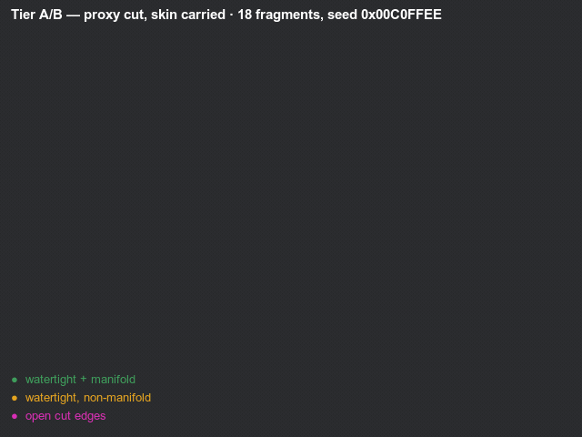

# Demos

Every example in the repo, and what each one is for. All four run from a clean checkout with no
assets and no setup:

```sh
cargo run --release --example fracture_cube   # terminal only — no window, no GPU
cargo run --release --example sever           # needs a GPU
cargo run --release --example explode         # needs a GPU
```

The clips below are **not screen recordings**. They come from two headless recorders,
`capture` and `capture_sever`, which render the same scenes on a fixed timestep with no window and no
wall clock. Frame 62 of one run is frame 62 of the next, so two GIFs taken either side of a change
differ only where the geometry does — which is what makes them worth committing. Regenerating them is
[at the bottom](#regenerating-these).

---

## `sever` — it comes apart where you hit it


The subject stays standing and you take pieces off it. One bake, cached at startup; every blow is a
region query against it plus a threshold, and whatever stops being connected falls off.

The clip is scripted — a projectile to the head, another to the shoulder, a slash across the chest, a
swept blade through the middle, a blast at the base. Run it yourself and you aim:

```text
  arrows / WASD   move the aim marker
  1               a projectile   — nearest fragment, then outward along the bonds
  2               a slash        — falloff from the segment a blade travelled
  3               a swept blade  — every bond the swing passed through, no falloff
  4               a blast        — falloff from a point in open space
  5               a pull         — weighted by how squarely each face meets it
  G               granularity — cycle which frontier of the bake is standing (3 / 8 / 16 / 34)
  R               reset
```

What the run above actually does, from its own log:

| blow | bonds reached | gave way | fragments off |
|---|---|---|---|
| projectile, head | 21 | 6 | 2 |
| projectile, shoulder | 82 | 22 | 1 |
| slash, chest | 98 | 58 | 12 |
| swept blade, middle | 34 | 34 | 8 |
| blast, base | 135 | 87 | 10 |

Note the second row: a hit that reaches 82 bonds and severs 22 still takes only **one** piece off,
because the rest are held on by bonds the region missed. That is the behaviour that makes repeated
damage read as wearing a thing down rather than as a switch.

**None of the decisions in that table are the crate's.** `bevy_autogib` hands back a *reach* — a
severity in `[0,1]` per bond — and `examples/common/body.rs` picks the threshold at which one gives
way, decides which island is still "the body", and throws the rest. A game scales that severity by
material and by how much damage the blow carried; the crate has neither fact.

---

## `explode` — prefracture, then one despawn and a spawn


The other half, and the shape a death actually wants: the subject is intact, then it *is* its own
fragments. The break is one despawn and a spawn, because the fracture was computed long before.

> **This clip is a hand-framed asset, not a generated one** — 560×398, tighter crop, no burned-in
> caption — and it is the repo's splash image. **Do not overwrite it from `capture`.** It was
> clobbered once by exactly that, which is the only reason this note exists.
>
> It also predates the AG-018 shape change, so its fragments are more uniform than the ones the code
> produces today. The clip below is the same subject and the same burst rendered from current
> geometry, so nothing on this page is misrepresenting the cutter — only this one clip's *framing* is
> historical.

**The red is not a colour choice, it is the whole idea.** Every fragment comes back as two meshes —
the subject's original surface and the faces this cut just created — so the inside can take a
different material. Render both with the skin material and the same fragments stop looking broken and
start looking disassembled.

Press **Space** to break it early, or to break it again with a new seed.

---

## `capture` — the same burst, coloured by what the audit says



`explode` is the one you watch; this is the one you *measure*. Same subject, same motion, but each
fragment is tinted by [`audit_proxy`](../src/audit.rs)'s verdict on it:

| colour | meaning |
|---|---|
| green | watertight **and** manifold — a closed solid, the thing we want |
| amber | watertight but not manifold — closed, yet not a surface a solver can trust |
| magenta | open cut edges — a cap that never closed, so this piece is not a solid at all |

All 18 come back green, and under Tier A they must: a plane through a convex cell yields two convex
cells, and there is no input for which that can fail. Magenta here would mean the cell clipper is
wrong, not that the subject was awkward.

The verdict is taken on the **proxy cell** — the artefact that is a solid — never on the render skin,
which is a surface subset and open by construction. Colouring by the skin's watertightness paints
almost everything magenta and says nothing.

For contrast, `fracture-baseline.gif` in this directory is the *before* picture, from the soup cutter
that predated the Tier A/B split.

---

## `fracture_cube` — the numbers, in a terminal

No window, no GPU, no `App`. A GIF of it would be a still image of text, so here is the text — it is
the fastest way to see what a settings change does.

```text
  granularity — one bake, read back at each piece count:
      2 asked →   2 pieces, total volume 0.2493
      3 asked →   3 pieces, total volume 0.2493
      5 asked →   5 pieces, total volume 0.2493
      8 asked →   8 pieces, total volume 0.2493
     12 asked →  12 pieces, total volume 0.2493

  adjacency — 37 bonds over 12 finest fragments
    intact, that is 1 island(s)
    severing fragment 1's 3 bond(s) leaves 2 island(s) of sizes [1, 11]

   #   centre (x, y, z)          half-extents         skin    cap   volume
  ─────────────────────────────────────────────────────────────────────────────────
    0    0.000  0.670  0.000    0.170 0.170 0.170      10      0   ############
    1   -0.000  0.337 -0.000    0.300 0.163 0.175      18     10   #########···
    2   -0.000 -0.057  0.095    0.300 0.433 0.080      13     15   ####········
    3    0.000 -0.180 -0.080    0.300 0.320 0.095      18     13   ###·········
    4    0.004  0.099 -0.007    0.296 0.401 0.168      13     17   #########···
    5    0.000 -0.176 -0.074    0.300 0.324 0.101      15     19   ####········
    6    0.000 -0.001  0.025    0.300 0.499 0.150      20     21   ######······
    7    0.054  0.156  0.058    0.246 0.344 0.117      18     13   ####········
    8   -0.041 -0.180 -0.059    0.259 0.320 0.116      13      5   ######······
    9   -0.022  0.083 -0.002    0.278 0.290 0.173      15     10   #######·····
   10    0.000 -0.317  0.048    0.300 0.183 0.127      20     16   #########···
   11    0.105  0.015  0.086    0.195 0.293 0.089       5      6   ###·········
  ─────────────────────────────────────────────────────────────────────────────────
  12 fragments · 178 skin triangles · 145 cut-face triangles
  the fracture itself took 2.11 ms.

   THE SOLID — each fragment's convex proxy cell, every face, closed
  ─────────────────────────────────────────────────────────────────────────────────
   watertight (no boundary edges)       12 of 12
   manifold                             12 of 12
   topological sphere (χ = 2)           12 of 12
   solid enough for a mesh collider     12 of 12
   volume enclosed                      0.2493
  ─────────────────────────────────────────────────────────────────────────────────

   THE DRAWN SURFACE — skin ∪ cut face. Open by construction; nothing here is a defect
  ─────────────────────────────────────────────────────────────────────────────────
   triangles                           323
   open edges (recorded, not asserted)  99
   non-manifold features                 9
   inside-out edges                      6   ← the seam
  ─────────────────────────────────────────────────────────────────────────────────

  re-fracturing with the same seed gave 12 pieces — bit-identical: true
```

Three things in there are worth reading twice.

**Every granularity conserves the same volume.** `2 asked` and `12 asked` are two frontiers of one
bake, not two bakes, and both tile the subject exactly once.

**The two audit blocks are different questions and must never be added together.** A fragment is a
closed convex *cell* and a *subset of the subject's own surface*. The first is a solid, and 12 of 12
come back closed. The second has a boundary because a subset of a surface has a boundary — those 99
open edges are where the skin ends and the cut begins, which is what makes it a subset. Tracked, never
asserted to zero.

**The volume bar is the size distribution.** It used to be keyed on the longest axis, which read every
slab as large and hid the thing `plane_jitter` and `size_spread` exist to change.

---

## Regenerating these

Any change that moves emitted geometry should regenerate them, or the picture stops describing the
code. Both recorders write one PNG per frame; `tools/gif.sh` does the encode, with a fixed two-pass
palette so two GIFs a week apart are actually comparable.

```sh
cargo run --release --example capture       -- --out frames-audit --tint audit
cargo run --release --example capture_sever -- --out frames-sever

LEGEND=audit tools/gif.sh frames-audit docs/fracture-tier-ab.gif "Tier A/B fracture — every fragment audited as a solid"
LEGEND=none  tools/gif.sh frames-sever docs/sever.gif            "sever — projectile, projectile, slash, blade, blast"
```

`LEGEND=none` omits the green/amber/magenta key, which belongs only on the audit-tinted clip: a key
naming colours that are not in the picture is worse than no key at all.

**`docs/explode.gif` is deliberately absent from that list.** It is the splash asset described above,
and `capture --tint demo` produces a differently-framed, captioned clip that is not a drop-in
replacement for it. If it ever genuinely needs regenerating, render to a scratch path first and look
at it next to the current one.

The two recorders share `examples/common/` — the headless harness, and the subject and damage rules
`sever` itself uses. That sharing is deliberate: a recorder that reimplements its subject drifts from
it silently, and the drift would be invisible in exactly the place you would look for it.
